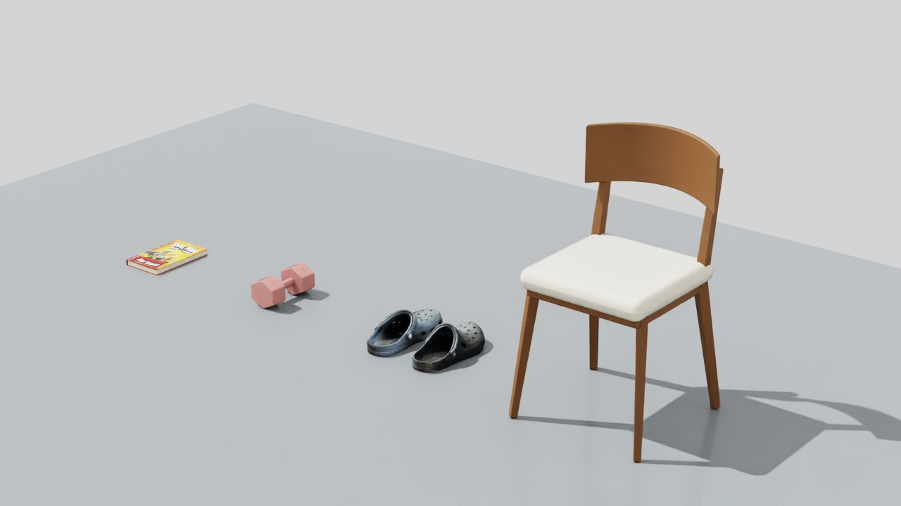
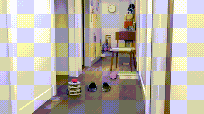
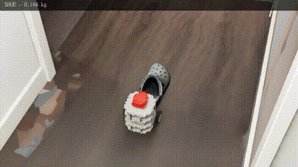
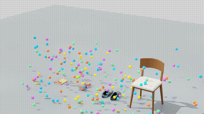
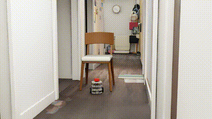
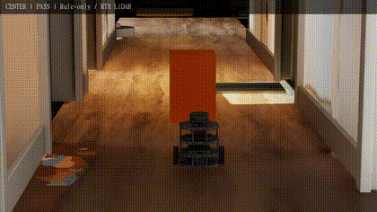

# NavBot Simulation

[Website](https://mondaywmd.github.io/monday-robotics-universe/) · [Project & experiments](https://mondaywmd.github.io/monday-robotics-universe/navbot-depth-obstacles.html) · [About Monday](https://mondaywmd.github.io/monday-robotics-universe/about.html)

Scene-specific Isaac Sim experiments for a TurtleBot3 Burger: motion, LiDAR, low-obstacle depth sensing, navigation, asset collisions, and deliberate pushing.

This is the simulation experiment record for [Monday's Robotics Universe](https://mondaywmd.github.io/monday-robotics-universe/). [SimForge Agent](https://github.com/mondaywmd/simforge-agent) covers the upstream Blender/asset pipeline; [NavBot PPO Navigation](https://github.com/mondaywmd/navbot-ppo-navigation) covers the earlier ROS/Gazebo learning experiments.

## 2026-09-25 · 先看实验

下面的动图是原录像的 **4 秒节选，按原时间播放**。点击预览或“完整视频”查看完整 MP4；图文记录包含方法、失败原因、参数和结果限制。

从真实物品扫描、Blender 清理／重建、USD 资产组织，到 Isaac Sim 的感知、导航与碰撞实验。

### 深度感知与分散避障

69.5 秒到达目标，采样未检测到接触；一组固定布局。

[▶ 完整视频](https://mondaywmd.github.io/monday-robotics-universe/assets/omniverse/depth-navigation/navigation.mp4) · [图文、操作与结果](docs/2026-09-25/04-depth-obstacles.md)

### 轻鞋与重物推撞

单只 188 g 鞋被推动约 34 cm；其他三件物体在本次参数下基本不动。

[▶ 完整视频](https://mondaywmd.github.io/monday-robotics-universe/assets/omniverse/depth-navigation/push.mp4) · [图文、操作与结果](docs/2026-09-25/04-depth-obstacles.md)

### 扫描资产与 200 球实验

书、鞋、哑铃、椅子经过 Blender 整理后进入 Isaac Sim；修正鞋口碰撞，让球能落入鞋内。

[▶ 完整视频](https://mondaywmd.github.io/monday-robotics-universe/assets/omniverse/scanned-assets/ball-shower-200.mp4) · [图文、操作与结果](docs/2026-09-25/02-scanned-assets-physics.md)

### 真实椅子通行

28.3 秒通过这一布局，包含椅腿间通行空间；附灯光与材质调整。

[▶ 完整视频](https://mondaywmd.github.io/monday-robotics-universe/assets/omniverse/chair-navigation/chair-navigation.mp4) · [图文、操作与结果](docs/2026-09-25/03-chair-navigation.md)

### LiDAR 安装与六组固定测试

五种布局到达目标，完全堵路的一组按预期停车。六组不是六个轮子，机器人是两轮差速底盘。

[▶ 完整视频](https://mondaywmd.github.io/monday-robotics-universe/assets/omniverse/navbot-navigation/navbot_fixed_suite.mp4) · [图文、操作与结果](docs/2026-09-25/01-lidar-navigation.md)

[查看四篇实验的完整目录与资料对照](docs/2026-09-25/README.md)

## Recorded results — September 24–25, 2026

| Experiment | Evidence and scope |
| --- | --- |
| Motion and wall contact | Local flat-ground forward/turn and corridor wall tests; not full-room validation. |
| Chair passage | One static chair layout passed in 28.3 s. The robot passes through available leg space; this is not evidence of an outside detour in every layout. |
| Depth detection | Empty target region: no false positive. Shoe, 2 cm book, and dumbbell detected at one fixed range with ideal rendered depth. |
| Scattered obstacle navigation | One fixed random seed, 20260925: reached goal in 69.5 s, sampled contact force 0 N, braking drift about 0.61 mm. Static obstacles. |
| Deliberate pushing | One 0.188 kg shoe moved about 33.86 cm; book ~1 kg, dumbbell 2 kg and chair 5 kg moved less than 0.1 mm under the chosen parameters. |
| 200-ball experiment | Recorded varied initial positions/velocities, bouncing and rolling; scene-local shoe collision override allows entry into the cavity. Not a complete dynamics calibration. |

## Watch the experiments

- [Depth sensing, scattered navigation and push comparison — videos, explanation, UI](https://mondaywmd.github.io/monday-robotics-universe/navbot-depth-obstacles.html)
- [Chair passage and visual setup](https://mondaywmd.github.io/monday-robotics-universe/navbot-chair-navigation.html)
- [LiDAR installation and earlier navigation checks](https://mondaywmd.github.io/monday-robotics-universe/isaac-lidar-navigation.html)
- [Scanned assets, Blender reconstruction and 200 balls](https://mondaywmd.github.io/monday-robotics-universe/scanned-assets-physics.html)
- [Initial robot import, motion, collision and capture](https://mondaywmd.github.io/monday-robotics-universe/isaac-navbot.html)

## Run locally

These are examples extracted from a working **Isaac Sim 6.1** project, not a standalone simulator package. They depend on its USD scenes, exact prim hierarchy, RTX LiDAR, and a separate `simforge_assets` library. Models, personal scans, raw recordings, caches and Python environments are not included.

1. Review the selected script before running. Several use the original local project path or derive it from the open scene. Adapt paths to your own installation.
2. Save current edits and open a scene from the NavBot Isaac Sim project's `isaacsim/scenes` directory.
3. Run one script at a time in Script Editor. Scripts may switch scenes, start physics, alter experiment parameters and overwrite their named output folders. Pressing Play alone does not start the navigation controller.
4. Read the JSON result and inspect the captured frames. Preserve a run before repeating it.

| Script | Purpose |
| --- | --- |
| `navbot_drive_test.py`, `test_corridor_motion.py` | Motion and local wall-contact checks |
| `navbot_lidar_test.py`, `navbot_lidar_stop.py` | LiDAR sampling and stop behavior |
| `navbot_navigation_suite.py` | Earlier fixed-layout rule-based navigation suite |
| `navbot_chair_final_test.py` | Recorded single-chair passage |
| `navbot_depth_validation.py` | Empty/low-obstacle depth checks and ground filtering |
| `navbot_depth_navigation.py` | Depth + LiDAR occupancy mapping and A* path following |
| `navbot_push_comparison.py` | Isolated dynamic-object pushing comparisons |
| `test_asset_acceptance.py` | Selected asset collision/contact checks |
| `record_corridor.py`, `record_ball_shower_200.py` | Scene-specific recording examples |

Results are in [results](results). Source examples were syntax-checked when packaged; their simulator runs were performed in the local project before packaging, not rerun from a clean clone.

## How depth-assisted navigation works

Horizontal LiDAR can miss a shoe beneath its roughly 18.2 cm scan plane. A downward-looking camera attached to `base_link` adds depth observations. The example fits a nearly horizontal ground plane, keeps low-obstacle points more than 1.2 cm above it, and combines them with LiDAR. It accumulates sensed points in a 2.5 cm grid and inflates obstacles by 17.5 cm before A* planning.

Goal/localization use simulator ground truth; obstacle coordinates are not passed to the planner. Unknown map cells initially count as free, and the map assumes static objects. The usable-depth guard is not independent timestamp verification. This is not SLAM, PPO, a dynamic-obstacle solution, or a guarantee of real-camera detection of a 2 cm book.

The preceding depth-plus-short-horizon steering attempt stopped near the dumbbell with no safe gap. Adding depth alone did not solve path selection. The passing result is one fixed layout, not a measured randomized success rate.

## Physics assumptions

Pushing tests use independent dynamic objects; navigation uses static obstacles. The single shoe is 188 g, book approximately 1 kg, dumbbell 2 kg, and chair 5 kg as a lower-bound estimate. Object static/dynamic friction is assumed 0.5/0.4 and each wheel effort cap 0.15 N·m. Floor combination, contact shape and drive parameters also affect the outcome. No foam deformation or real-world calibration was performed. Do not interpret the results as proof that all heavy objects cannot move.

Navigation monitors sampled contacts between robot bodies and obstacle/non-floor corridor colliders. A 0 N report is a sampled result, not a continuous-time proof.

## Recording notes

Navigation and push videos use viewport frames sampled at about 5 Hz and encoded according to their simulation timestamps into 25 fps video. Encoding frame rate does not create additional captured motion. The 200-ball recording uses a separate native frame capture workflow. Large video files remain linked from the journal rather than duplicated here.

## Next validation

Vary layouts and seeds, quantify success/failure, add depth noise and occlusion, strengthen sensor freshness checks, then consider movable obstacles. Preserve both passing and failed runs.
