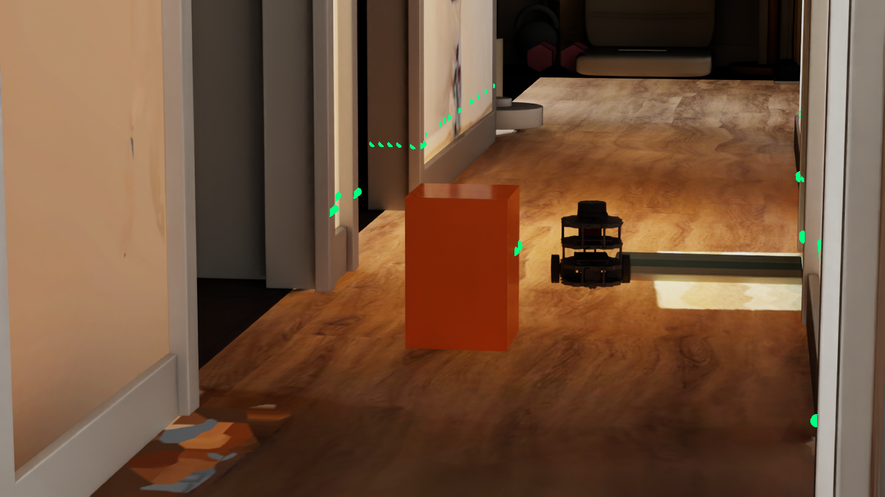
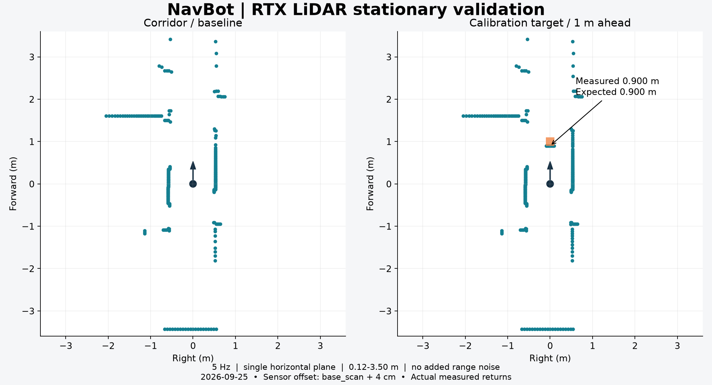
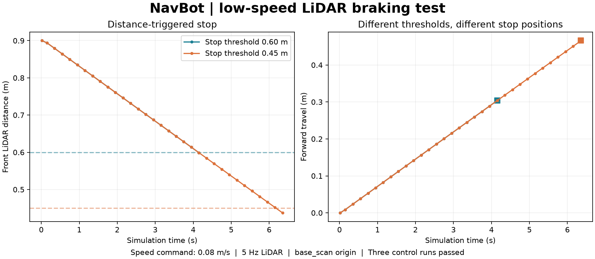
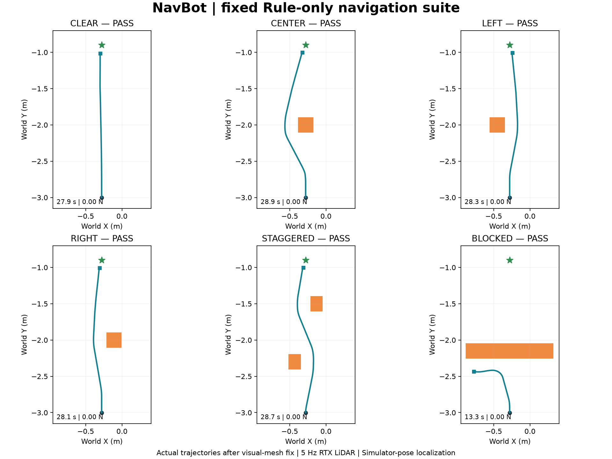

# 先看见障碍， 再决定往哪里走。

2026-09-25 · [网站图文与视频](https://mondaywmd.github.io/monday-robotics-universe/isaac-lidar-navigation.html) · [返回实验目录](README.md)

DEVLOG · 2026.09.25 · RTX LIDAR / RULE-ONLY

从安装 RTX LiDAR、校准扫描方向与近距离返回，到遇障停车，再用同一个控制器完成六轮固定导航测试。五种布局到达目标，完全堵路时主动停车。

恢复 visual mesh 后的 NavBot：传感器与机器人在同一走廊场景中工作。

[上一篇：URDF 导入、差速控制与走廊碰撞 →](https://mondaywmd.github.io/monday-robotics-universe/isaac-navbot.html)

01 / MOUNT THE SENSOR

## 外壳已经在， 现在让 LiDAR 真正输出数据。

在独立 navbot\_lidar\_test.usda 中添加真实 RTX LiDAR，挂在 base\_link / base\_scan 下。基于 NVIDIA Example\_Rotary 配置生成本地 navbot\_planar\_lidar.usda，展开引用后不再依赖在线传感器文件。

配置为单水平扫描面、5 Hz、每圈 360 个名义发射角、标称 0.12–3.5 m 量程，本轮不加噪声。初始安装额外抬高 4 cm，随后校准恢复到 URDF 的 base\_scan 原点；这是仿真坐标对齐，不是真实硬件标定。

通过 LidarSensor 读取 Generic Model Output，等待完整扫描并按 frameId 排除重复帧。返回有效命中点不一定有 360 个：先归入一度距离槽，再压缩为 36 个扇区最小距离。RTX 读取可见几何，不能等同于 PhysX collision raycast。

02 / CALIBRATE BEFORE DRIVING

## 先用已知位置， 检查它看见的距离。

机器人静止，在雷达前方 1 m 放置边长 0.2 m 的方块。预期前表面距离 0.900 m，实测 0.899998 m。之后独立检查左侧 +90° 和右侧 −90°：两个 0.300 m 目标均通过。

初始静态扫描与前方已知距离校准；这一步只验证了 0.9 m，不能证明整个量程有效。

STARTUP

### 从空数据到有效扫描

初始遇到 Hydra engine 配置不匹配和空输出。启动时启用 Motion BVH，统一 viewport tickRate=0 并保留同步渲染设置；重启后默认传感器输出成功。自定义单线 channelId 改为 [1] 后完成扫描。未用单变量实验拆分所有启动设置的因果关系。

NEAR RANGE

### 0.3 m 目标为什么丢了？

只设 nearRangeM=0.12 不够。本次发现 minDistBetweenEchosM 默认 0.4，改成 0.01 m 并重载场景后，0.3 m 左右目标返回正常。修正保存在 navbot\_lidar\_stop\_test.usda 层；不要把初始静态场景当成最终配置。

VISUAL DEBUG

### 只剩红色小块的机器人

机器人位姿与 mesh 仍在，visual 实例渲染异常。将四个 visual 根节点的 instanceable 关闭后恢复显示，修改保存在共享测试层，未修改原机器人资产。红色小块是 camera\_link 外观，不是 LiDAR；绿色点才是扫描调试显示。

03 / SCAN → STOP

## 先学会停， 再尝试绕行。

取前方 ±10° 的最近有效距离，以 0.08 m/s 低速前进。无校准方块时 2 s 前进约 0.147 m；停车阈值分别设为 0.60 m、0.45 m，最终雷达到目标表面的距离约 0.596 m、0.434 m。发出制动指令后移动均不到 1 mm。

方向校准与两个阈值的遇障停车测试：距离从雷达原点计算，不是机器人外壳净空。

5 Hz 扫描会带来离散采样延迟，因此停车距离可能略低于阈值。超过 0.6 s 没有新扫描会归零并报错，这是代码保护；本轮没有专门注入断流故障验证。

04 / SIX FIXED CASES

## 能绕开， 也能承认没有路。

使用同一个局部 Rule-only 控制器：从扫描估计可通行方向，以 0.17 m 半径圆形包络预留空间，结合目标方向选择前进或转弯。线速度上限 0.08 m/s，角速度上限 0.6 rad/s。控制器不读取障碍摆放坐标；目标方向使用仿真器真实位姿。

[▶ 观看实验视频（MP4）](https://mondaywmd.github.io/monday-robotics-universe/assets/omniverse/navbot-navigation/navbot_fixed_suite.mp4)

**六轮真实仿真 · 约 2 分 47 秒**

每轮独立重置。五种通行布局到达目标，横向堵路布局因连续无明显进展而停车。不是关键帧动画。

[打开视频 ↗](https://mondaywmd.github.io/monday-robotics-universe/assets/omniverse/navbot-navigation/navbot_fixed_suite.mp4)

本轮每个固定布局执行一次，6 / 6 达到预期

| 布局 | 仿真时长 | 最终目标误差 / 状态 | 结果 |
| --- | --- | --- | --- |
| 无障碍 | 27.9 s | 11.9 cm | 通过 |
| 居中障碍 | 28.9 s | 11.3 cm | 通过 |
| 偏左障碍 | 28.3 s | 11.6 cm | 通过 |
| 偏右障碍 | 28.1 s | 11.3 cm | 通过 |
| 交错双障碍 | 28.7 s | 11.0 cm | 通过 |
| 完全堵路 | 13.3 s | 停车（未到目标） | 通过 |

六轮实际轨迹与障碍布局。堵路轮次未到达目标，按预设停车标准通过。

**通过标准与证据范围**

通行轮次要求进入目标 0.12 m 范围；堵路轮次要求在障碍前因无通路或连续 5 s 无明显进展停车。两者均要求采样接触力分量不超过 0.1 N、制动后位移小于 0.03 m，超时不算通过。

监测机器人六个刚体与测试障碍、走廊非 Floor collider 的接触。本轮记录到的最大力分量均为 0 N，制动位移均小于 0.8 mm；这是控制循环采样结果，不是连续接触的形式化证明。

05 / REPLAY & RECORD

## 保留脚本， 让实验可以重新检查。

下载包含四份实际使用的 Python 脚本，以及安装、停车、导航的说明。依赖本项目既有 USD 场景与 Prim 层级；不包含机器人、房间或完整传感器资产，并非任意电脑一键运行的项目。

[下载脚本与说明](../../examples/published-bundles/navbot-lidar-navigation-scripts)

1. 01

   **STARTUP**

   ### 以已验证配置启动

   本地使用 launch\_lidar\_sync.ps1，等待场景和 shader 加载。启动设置和扩展要求见下载包 README；Python Server 是远程执行通道，直接使用 Script Editor 不要求它。
2. 02

   **LIDAR**

   ### 先扫描，再停车

   File → Open 初始 LiDAR 场景，Window → Script Editor 载入 navbot\_lidar\_test.py，Run。方向与近距修正测试则打开 navbot\_lidar\_stop\_test.usda，运行 navbot\_lidar\_stop.py。校准方块由脚本创建，测试中回到起点属于重置。
3. 03

   **NAVIGATION**

   ### 运行六轮测试

   先保存编辑，再在本项目场景中运行 navbot\_navigation\_suite.py。它会切换场景、覆盖同名测试层和报告，完成后暂停。只跑一轮的方法见 navigation-suite.md。不要同时运行其他控制脚本。
4. 04

   **CAPTURE**

   ### 按仿真时间生成录像

   本轮使用 Kit capture\_viewport\_to\_file，在控制循环中约每 0.2 s 采集一帧，同时记录仿真时间。另运行 encode\_navigation\_suite.py，通过 FFmpeg 按时间戳编码为 25 fps 容器；重复帧不代表采集达到 25 Hz。每轮末尾保留约 1 s。与上一篇的 Movie Capture 录制脚本是不同路径。

[六轮结果 JSON](../../results/navbot_fixed_suite_results.json) · [校准与停车原始报告](../../results/lidar_stop_report.json)

NEXT TRANSMISSION

## 把真实物品， 带进下一轮测试。

下一步计划扫描训练锥、书本等家中物品，经 Agent → Blender → sim-ready asset 流程进入 Isaac Sim，再扩展重复测试。当前控制器是新建的局部规则基线，没有接入原 Gazebo PPO、ROS2 或 SLAM；角度采样与 78 维时序观测仍需对齐。本轮不代表随机布局、动态障碍或定位误差下都可靠。

[下一篇：扫描资产与 200 球碰撞 →](https://mondaywmd.github.io/monday-robotics-universe/scanned-assets-physics.html)