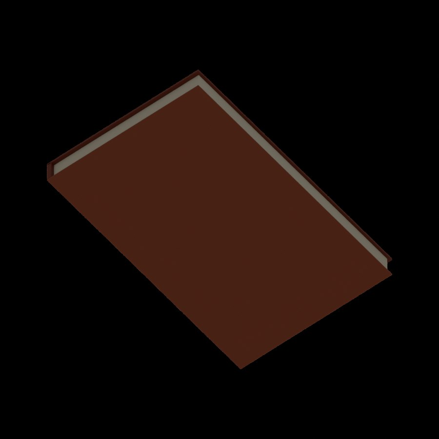
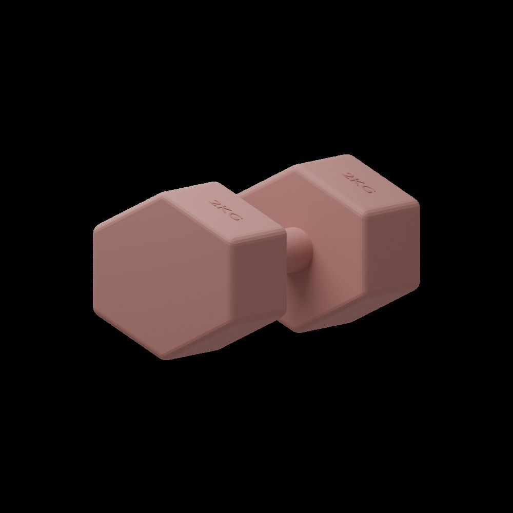
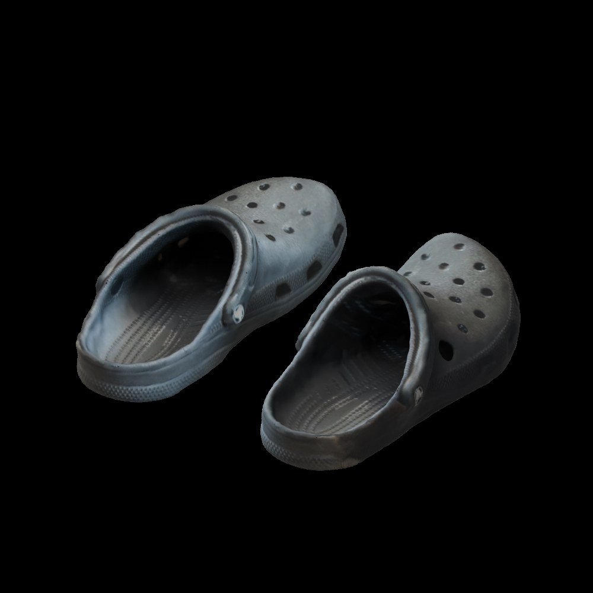
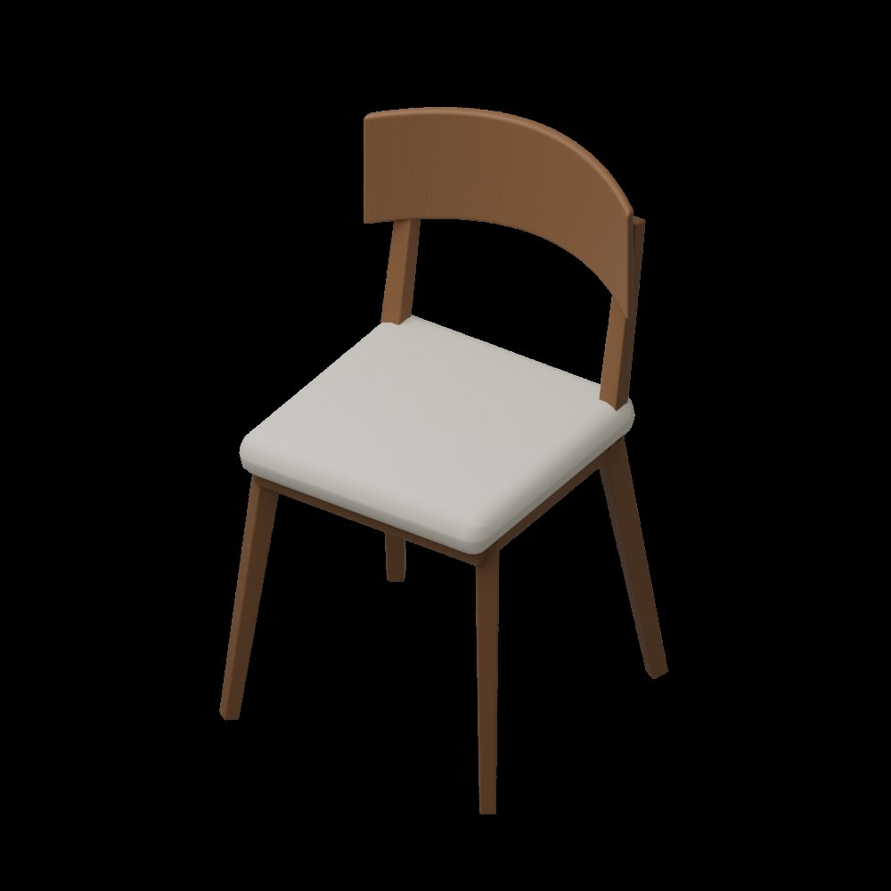

# 把家里的物品， 变成能碰撞的数字资产。

2026-09-25 · [网站图文与视频](https://mondaywmd.github.io/monday-robotics-universe/scanned-assets-physics.html) · [返回实验目录](README.md)

DEVLOG · 2026.09.25 · SCAN / BLENDER / ISAAC SIM

从自己扫描的书、哑铃、鞋和椅子开始：清理、补全、重建，再导入 Isaac Sim。最后用 200 个随机落下的小球，检查它们是否真的具备我们看到的形状。

00 / THE ASSET LIBRARY

## 做一个资产库， 让建模成果反复进入实验。

这条路线的目标不是只做一段漂亮演示，而是把家里的真实物品逐步整理成可复用的仿真障碍库。每次扫描和建模都留下一个独立资产，之后可以重复用于不同房间、不同摆放方式和不同机器人测试。

**真实物品 → 扫描参考 → Agent + Blender 整理 → USD 资产 → Isaac Sim 验证 → 场景复用。** 扫描回答“它长什么样”；Blender 处理缺面、尺寸、材质和结构；USD 把资产带入仿真；Isaac Sim 检查“它是否能碰撞、是否能被传感器看到”。验证结果反馈到建模和碰撞设计，而不是导出成功就算完成。

SOURCE

### 保留原始输入

原始扫描单独保存，便于回看和重新处理。实物尺寸、照片与扫描限制一起记录。

ASSET

### 每件物品独立管理

每个资产有自己的 Blender、USD、预览和说明，区分 Visual 与 Collision。源资产与实验场景分开，通过引用组合；测试中的特殊碰撞设置保存在测试层。

EVIDENCE

### 验证跟着资产走

记录尺寸、补全方式、碰撞策略、已通过的测试与仍存在的限制。能被小球碰到，不代表导航一定能避开；验证范围需要写清。

当前本地资产库名为 `simforge_assets`，按物品组织 `raw / blender / usd / previews`，配套说明与资产信息；Isaac Sim 项目保存引用这些资产的场景、脚本和测试录像。大型模型和纹理先留在本地，网站用于展示实验，GitHub 适合管理流程、代码和轻量目录信息。这里的目录信息是可逐步完善的索引，不等于已经建立了在线资产仓库。

这样，SimForge Agent 的环境制作与 Omniverse 的仿真验证就连起来了：先积累可信的单件资产，再组合成导航场景，最后扩展到不同布局与训练。资产库是这几步之间可以持续复用的基础。

01 / REAL OBJECTS

## 先扫描，再核对真实尺寸。

我扫描了家中的四组物品，得到 book\_01.glb、dumbbell\_01.glb、shoe\_01.glb 和 chair\_01.glb。扫描能提供形状与纹理线索，但缺面、地面碎片和尺度仍需要检查。我补充了实物的大致尺寸，作为建模约束，而不是把扫描当成精密测量。

四组本地资产进入 Isaac Sim：书、哑铃、一双鞋和椅子。

| 资产 | 尺寸约束 | 处理方式 |
| --- | --- | --- |
| 书 | 15 × 24 × 2 cm | 重建封面、书脊和书页块 |
| 哑铃 | 20 × 10 × 10 cm | 重建六角头、握柄与浮雕文字 |
| 鞋 | 单只约 30 × 13 × 10 cm | 清理扫描、补底、重建网格与纹理烘焙 |
| 椅子 | 45 × 45 × 80 cm | 重建椅腿、框架、坐垫和弧形靠背 |

02 / BLENDER REBUILD

## 扫描是参考，交付需要完整几何。

书最初的底部是空的。与其强行保留破损扫描，我让 Agent 根据扫描和实物尺寸重建闭合的书本：正面封面纹理来自扫描，背面、侧边和书页块为重建内容。

检查书的底面：补全后的实体结构，不再只是一层扫描表面。

哑铃上的文字曾浮在表面上方；修正位置与方向后，文字贴合斜面并略微嵌入。

鞋保留扫描外观并补全底部；左鞋由修复后的右鞋镜像生成。

鞋的处理包括移除扫描地面、修复接缝、补洞、Voxel Remesh 与纹理烘焙。左鞋并非独立扫描重建，它连同纹理由右鞋镜像；细小孔洞也有所简化。椅子则按尺寸重建，木纹和坐垫材质为重新制作，不能当作原始扫描纹理。

重建后的椅子保留腿间和座下空间，作为后续碰撞检查的重要部位。

03 / SIM-READY

## 外观之外，还要有明确的物理边界。

资产统一使用 meters、Z-up，底部落在 Z=0；Visual 与 Collision 分离。书使用简单 Box collider，哑铃使用分段 Convex Hull，椅子拆成多个凸形碰撞体，保留腿间空隙。原始扫描、Blender 文件、USD、预览和说明分开保存在本地资产库。

这些物品先作为静态障碍，没有给资产随意指定质量或动态刚体属性。独立验收场景完成了小球接触检查，并用射线检查鞋间与椅子下方的指定空隙。测试是有限位置的验证，不代表所有碰撞形状都已检查完。

还做了两个高度的 RTX LiDAR 检查：在机器人约 18.2 cm 的水平扫描面，书、哑铃和鞋低于扫描高度，没有命中是预期现象；椅子能被检测到。降低扫描高度后，三个低矮物品也能被检测。这说明“物理上会撞到”不等于“这条水平激光一定看得到”。

04 / DEBUG THE COLLISION

## 球为什么黏住？为什么进不了鞋？

第一版小球视频不好看：球接触后停得太快。记录位置和速度后发现，有些球甚至反弹到半空就速度归零。测试球的 Sleep Threshold 与 Stabilization Threshold 同时调为 0 后，运动恢复连续；这轮没有分别隔离两个参数的影响，所以不把原因归结为其中某一个参数。

随后增加球的弹性：Restitution 0.68，combine mode 为 max；静摩擦 0.28、动摩擦 0.20。低阻尼允许球反弹后继续滚动。这是演示测试配置，不是所有训练场景的默认推荐。

另一个关键发现来自我的问题：“球掉不进鞋，是不是因为 Convex Hull？”确实，每只鞋原来分成三段凸包，保留了两鞋之间的间隙，却封住了鞋口凹陷。测试层中禁用这些凸包，改为静态 Triangle Mesh collision 后，检测能穿过鞋口碰到内部鞋底，小球也能真正进入鞋里。原资产文件保持不变，精细碰撞覆盖只保存在这次测试场景。

05 / TWO HUNDRED BALLS

## 从整齐下落，变成有差异的碰撞。

实验从 24 球、100 球迭代到 200 球。固定相机下，分散初始位置、高度、三轴速度与旋转速度，避免整排同步落下。188 个球半径为 2.6 cm，另有 12 个半径 1.6 cm 的小球对准鞋口，以较小横向速度落下；它们依然由物理仿真运动，没有使用关键帧或吸附。

[▶ 观看实验视频（MP4）](https://mondaywmd.github.io/monday-robotics-universe/assets/omniverse/scanned-assets/ball-shower-200.mp4)

**200 球随机碰撞 · 12 秒 · 1280 × 720 / 30 fps**

独立 Play 采样中有 10 个球进入鞋内检查区域。视频是之后重置录制的另一轮，数值记录并非视频逐帧测量。

[打开视频 ↗](https://mondaywmd.github.io/monday-robotics-universe/assets/omniverse/scanned-assets/ball-shower-200.mp4)

录制使用 Movie Capture 输出 360 张 PNG，再用 FFmpeg 编码 MP4，并完成解码检查。之前内置视频编码曾停滞，帧序列方式保留了可恢复的原始画面。24 球和 100 球的版本也保存在本地。

06 / REPLAY

## 保留实验，也保留操作方法。

在 Isaac Sim 中打开本地 `asset_ball_shower_200.usda`，切换到 `/World/ShowerCamera`，按 Play 观察，Stop 重置。查看鞋的碰撞时启用 Collider 可视化；材质参数在球绑定的 Physics Material 中。准备重跑录制前先保存当前编辑，再在 Script Editor 运行脚本。

下载包包含实际录制脚本及说明。需要本项目已有验收场景、资产库和 Isaac Sim；不含扫描模型与纹理，也不是任意电脑一键运行的完整项目。原始素材与大型资产继续保存在本地。

[下载录制脚本与说明](../../examples/published-bundles/ball-shower-scripts)

NEXT TRANSMISSION

## 让机器人面对， 真正来自生活的障碍。

下一步把这些资产布置进走廊，检查机器人碰撞包络、低矮障碍的传感器盲区，再扩展导航测试。当前完成的是资产与物理验证，还没有把这些新物品接入 PPO 训练。

[下一篇：真实椅子通行验证](https://mondaywmd.github.io/monday-robotics-universe/navbot-chair-navigation.html)