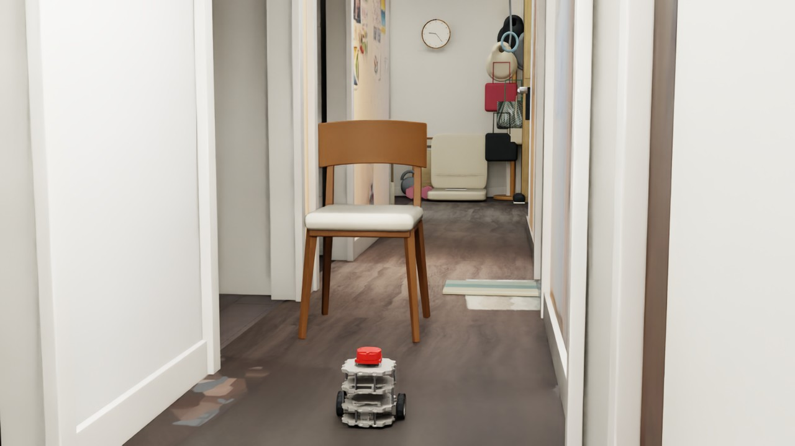
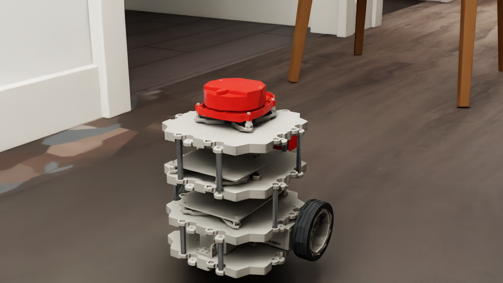
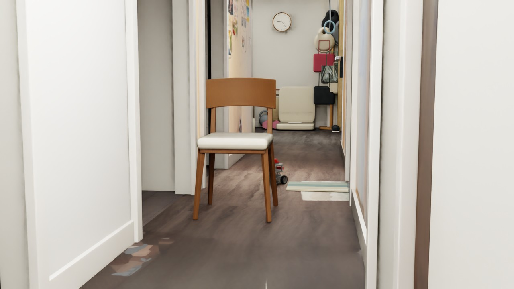

# 让真实的椅子， 进入机器人走廊测试。

2026-09-25 · [网站图文与视频](https://mondaywmd.github.io/monday-robotics-universe/navbot-chair-navigation.html) · [返回实验目录](README.md)

DEVLOG · 2026.09.25 · NAVBOT / REAL-WORLD ASSET

资产完成碰撞验收之后，下一步是把它带进导航场景。这次沿用现有两轮差速 NavBot 和 Rule-only 控制器，检查机器人如何通过一把扫描重建的椅子。录像显示它通过椅腿之间、座面下方的空间，而不是绕过整把椅子的外侧。

01 / FROM ASSET TO SCENE

## 先做一个有边界的小实验。

将上一轮在 Blender 重建并导出 USD 的椅子引用到独立走廊测试场景，放在走廊偏左侧。椅子约 45 × 45 × 80 cm，保持静态，使用分段碰撞体保留椅腿和座下空间。机器人从原起点出发，目标位于椅子后方。

控制器仍然使用 RTX LiDAR 扫描选择局部行驶方向，线速度上限 0.08 m/s、角速度上限 0.6 rad/s；目标方向使用仿真真实位姿。本次没有接入 PPO，也没有把障碍坐标直接提供给避障控制器。

用户确认的观测机位：同时看到机器人、椅子和走廊尽头。

02 / MAKE THE TEST VISIBLE

## 呈现也需要对照真实参考。

最初场景近处偏暗、远端像黑屋子，机器人几乎成为剪影。对照家中原始照片，调整环境补光、三盏暖色顶灯和后方日光；另给机器人附近地面添加柔光，保留中段亮度层次。ObservationCamera 经手动确认后保存，用于本次测试录制。

近处左墙的照片材质呈棕色，将对应表面恢复为白墙。地板原来使用偏黄的拍摄纹理并带有自发光表现，改为参与场景照明的材质，降低饱和度、调成较中性的灰棕木色。这是参考照片进行的视觉校正，不是经过测量的照度或材质标定。

机器人也重新区分塑料、橡胶和金属质感。最终选用原灰色与乳白色按 70% / 30% 混合的暖灰塑料，搭配红色 LiDAR 外壳、黑色橡胶胎面及金属支柱。这是自定义配色，不是原厂配色；本轮调整的是渲染材质，没有修改轮胎摩擦或机器人动力学参数。

最终采用的暖灰塑料与红色 LiDAR：独立近景展示，测试仍使用全局观测相机。

03 / THE RECORDED RUN

## 到达目标，也记录停车和接触。

[▶ 观看实验视频（MP4）](https://mondaywmd.github.io/monday-robotics-universe/assets/omniverse/chair-navigation/chair-navigation.mp4)

**最终视觉配置下的椅子通行录像**

约 5 Hz 采集，按记录的仿真时间编码为 25 fps 视频，末尾保留约 1 秒。编码帧率不等于原生采集频率。

[打开视频 ↗](https://mondaywmd.github.io/monday-robotics-universe/assets/omniverse/chair-navigation/chair-navigation.mp4)

|  |  |
| --- | --- |
| 最终状态 | 到达目标 |
| 行驶仿真时间 | 28.3 s |
| 目标距离 | 11.0 cm（阈值 12 cm） |
| 采样最大接触力分量 | 0.000 N |
| 制动后位移 | 0.53 mm |

监测机器人六个刚体与椅子 collider、走廊非地面 collider 的接触；达到目标且接触力不超过 0.1 N、制动位移小于 3 cm 判为通过。这次符合标准。0 N 是采样结果，不等于连续接触的形式化证明。

本次测试结束位置：机器人到达椅子后方的目标附近。

04 / REPLAY & LIMITS

## 保留证据，不扩大结论。

此次证明的是当前椅子位置、当前起终点的一次低速导航成功。实际路径经过椅子下方；水平 LiDAR 与局部控制器允许利用腿间空隙，所以不能将本次结果描述成整把椅子的外侧绕行验证。它不代表所有椅子朝向、随机布局或动态障碍都能通过；也没有验证低矮的书、鞋和哑铃能被当前水平扫描面检测。

在 Isaac Sim 打开保存的 `navbot_scanned_chair.usda`，选择 `/World/ObservationCamera`。自动导航需要运行测试脚本，单按 Play 不会自动执行完整控制逻辑。先保存编辑，在 Script Editor 中运行 `navbot_chair_final_test.py`，完成后查看报告和录像帧。

[查看测试结果 JSON](../../results/report.json) · [下载脚本与说明](../../examples/published-bundles/chair-test-script)

下载包依赖现有本地场景和资产，不含完整模型。视觉调整保存在实验场景层，本次不是对所有历史场景或源资产的统一更新。

NEXT TRANSMISSION

## 看得见椅子， 不代表看得见地上的书。

下一步检查低矮物品与水平 LiDAR 的高度关系，区分检测失败和控制失败，再决定是否补充感知或改变测试设置。

[下一篇：深度感知、绕行与推撞](https://mondaywmd.github.io/monday-robotics-universe/navbot-depth-obstacles.html)