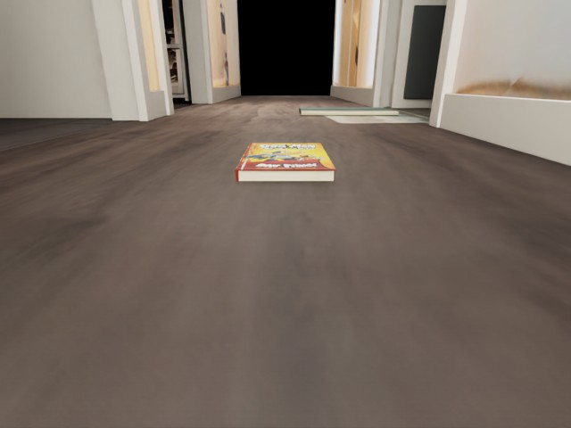
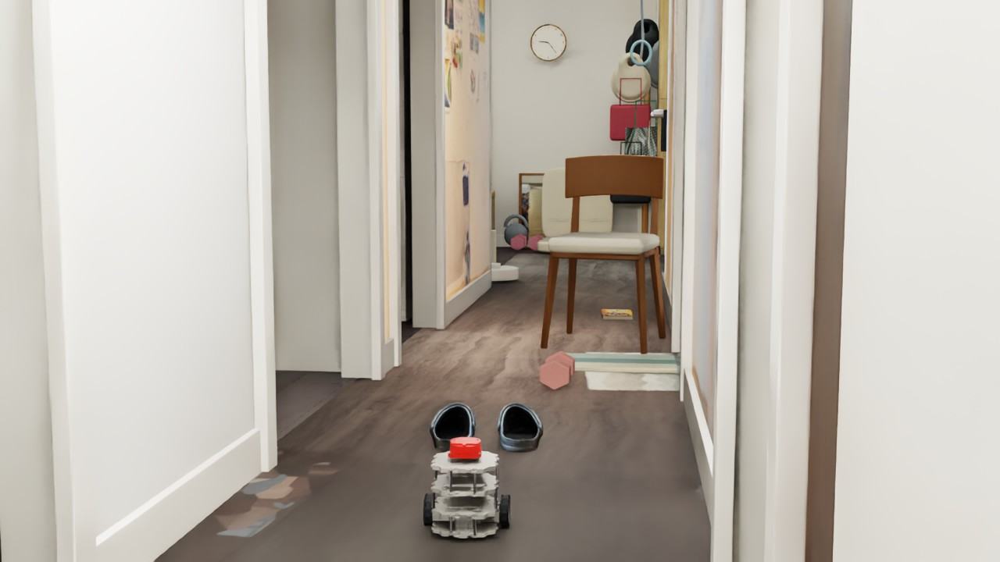
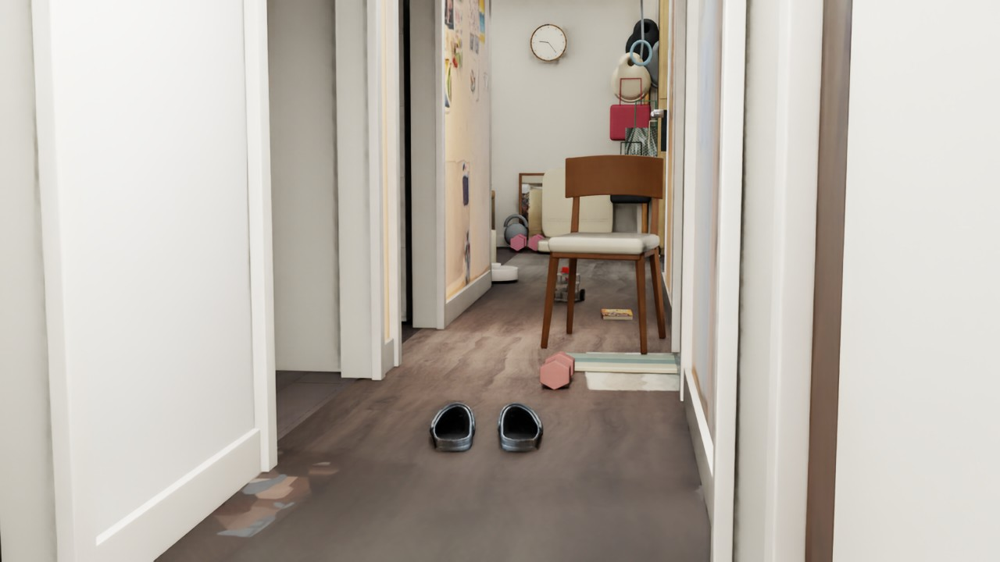

# 看见地上的鞋， 再决定怎样通过。

2026-09-25 · [网站图文与视频](https://mondaywmd.github.io/monday-robotics-universe/navbot-depth-obstacles.html) · [返回实验目录](README.md)

DEVLOG · 2026.09.25 · DEPTH / NAVIGATION / CONTACT

把扫描资产带入机器人测试后，出现了两个不同的问题：低矮物品能不能被看到？接触以后又能不能被推走？这次把感知、规划和物理推撞分别验证。

01 / THE BLIND SPOT

## 看见椅子，不代表看见鞋。

水平 LiDAR 扫描面约高 18.2 cm，而鞋、哑铃约高 10 cm，书只有 2 cm。扫描可能从这些物体上方穿过。原先只有 LiDAR 的分散布局测试在鞋前发生接触；那一轮鞋是静态障碍，不能据此认定机器人推不动两只轻鞋。

保留原有水平 LiDAR，并在机器人前部添加向下俯视约 21° 的深度相机。640 × 480 的深度图提供三维表面点，水平 LiDAR 继续观察墙和高处障碍。相机附着在 base\_link，跟随机器人运动。

深度相机对应的 RGB 视角：从低处观察地面与 2 cm 厚的书。

02 / REMOVE THE FLOOR

## 看到地面，也能把它分出来。

先将深度图还原为三维点，再用 RANSAC 拟合接近水平的地面平面。高出拟合地面超过 1.2 cm 的点作为低位障碍候选。这样地面不会全部变成障碍，也没有直接读取仿真地板高度作为答案。

静态检查中，空地目标区域检出 0 个障碍点；鞋、书、哑铃分别检出 9,715、3,415、4,458 个点，四个检查均通过。已知摆放区域只用于评估检测结果。

这是理想渲染深度、固定距离的一组验证。真实深度相机的噪声、材质、遮挡和安装误差还未测试，不能据此保证真实设备稳定发现 2 cm 厚的书。

03 / FROM DETECTION TO ROUTE

## 感知补上以后，还需要提前规划。

只把深度点加入原来的短距离转向规则，机器人虽然绕过鞋子，却在哑铃附近找不到安全方向而停车，未通过。随后把传感器观测累积到 2.5 cm 网格，按机器人半径与余量膨胀 17.5 cm，用 A\* 规划连续路径，再低速跟随。

四种资产用固定随机种子 20260925 分散摆放，导航实验保持静态。规划器使用传感器点，不接收资产摆放坐标；定位和目标方向仍使用仿真真实位姿，尚未接入 SLAM 或 PPO。地图假设障碍不移动，未知区域初始可通行。

鞋、哑铃、椅子和书沿走廊分散摆放，保留通行空间。

[▶ 观看实验视频（MP4）](https://mondaywmd.github.io/monday-robotics-universe/assets/omniverse/depth-navigation/navigation.mp4)

导航录像（去掉开头一帧相机切换画面）：约 5 Hz 采集，按仿真时间编码为 25 fps，末尾保留约 1 秒。

[打开视频 ↗](https://mondaywmd.github.io/monday-robotics-universe/assets/omniverse/depth-navigation/navigation.mp4)

本轮结果：**69.5 秒到达目标**，终点误差约 11.8 cm（阈值 12 cm）；采样最大接触力分量 0.0 N，停车后位移 0.61 mm。监测机器人六个刚体与障碍、非地面走廊碰撞体的接触，阈值为 0.1 N。采样无接触不等于连续时间的形式化保证。

这是同一固定布局的一次成功结果，还不能称为随机布局全部通过。深度有效性检查也没有独立验证传感器帧时间戳，后续还需强化失效处理。

机器人到达四种物品后方的目标区域。

04 / PUSHING IS A SEPARATE TEST

## 188 克的鞋，和更重的物体。

独立推撞实验每次只放一个动态物体，采用较高的近景机位观察接触。鞋只启用一只，质量 188 g；书约 1 kg、哑铃 2 kg、椅子使用 5 kg 作为用户给出的重量下限。

[▶ 观看实验视频（MP4）](https://mondaywmd.github.io/monday-robotics-universe/assets/omniverse/depth-navigation/push.mp4)

四段独立测试：鞋、书、哑铃、椅子。机器人低速前推 12 秒，然后停车。

[打开视频 ↗](https://mondaywmd.github.io/monday-robotics-universe/assets/omniverse/depth-navigation/push.mp4)

| 物体 | 设置质量 | 水平位移 |
| --- | --- | --- |
| 一只鞋 | 0.188 kg | 约 33.86 cm |
| 书 | 约 1 kg | 约 0.080 mm |
| 哑铃 | 2 kg | 小于 0.001 mm |
| 椅子 | 5 kg 下限假设 | 小于 0.001 mm |

四组都检测到接触。当前参数下鞋被推走，其他物体的位移接近数值误差。但“重”不是推不动的唯一原因：几何、摩擦和驱动能力也参与决定结果。

物体静／动摩擦统一假设为 0.5／0.4、恢复系数为 0；每轮驱动力矩上限假设为 0.15 N·m，未做真实测量标定。地面材质也会影响组合摩擦。鞋采用刚体近似，未模拟泡沫压缩或鞋底变形，因此这些结果不是实物推动能力的预测。主动推撞与导航避障使用不同场景，不能混用结论。

05 / REPLAY

## 脚本、结果和 UI 重放。

先保存当前编辑，在 Isaac Sim 中打开本项目场景。Window → Script Editor 中分别运行下载包里的深度检查、导航或推撞脚本，一次只运行一个；仅按 Play 不会启动整套导航控制。

导航使用 NavTestCamera；推撞使用 PushCamera；深度相机挂在 base\_link 下。脚本自动切换到独立测试场景，结束后暂停，并保存报告与录像帧。重新运行会覆盖对应测试输出，请先备份要保留的记录。

[下载三个 Python 脚本与重放说明](../../examples/published-bundles/scripts) · [导航报告](../../results/navigation-report.json) · [深度检测报告](../../results/detection-report.json) · [推撞报告](../../results/push-report.json)

脚本依赖现有本地走廊、机器人、LiDAR 和 simforge\_assets 资产库；下载不包含模型。视频使用视口逐帧采集与按时间戳编码，采集频率约 5 Hz。

## 下一步：换布局，检验可靠性。

增加不同摆放、遮挡和深度噪声，记录通过率与失败原因，再考虑动态可推动障碍。

[上一篇：椅子穿行实验](https://mondaywmd.github.io/monday-robotics-universe/navbot-chair-navigation.html)