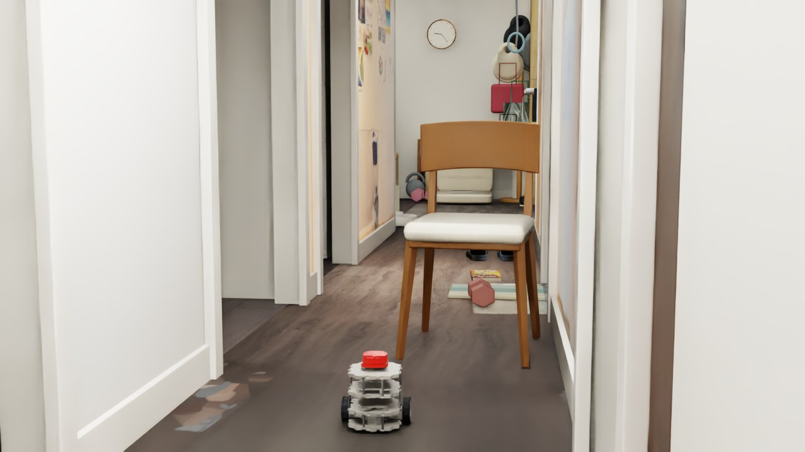
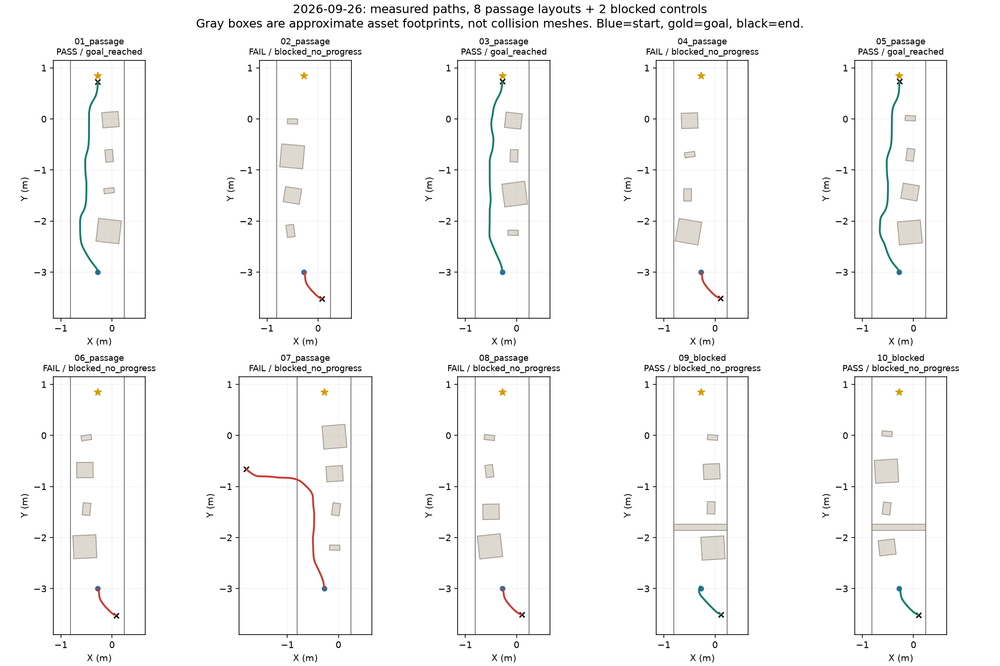
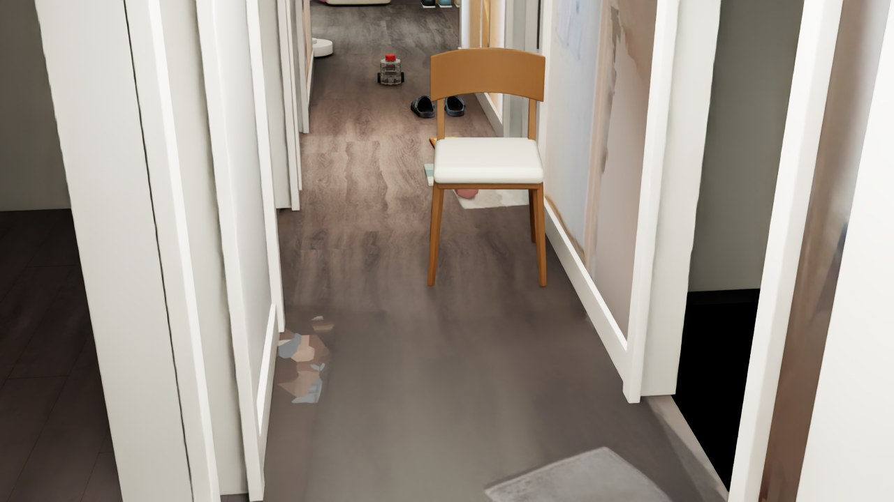
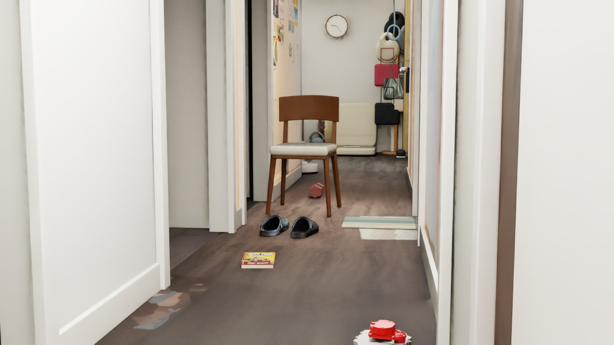
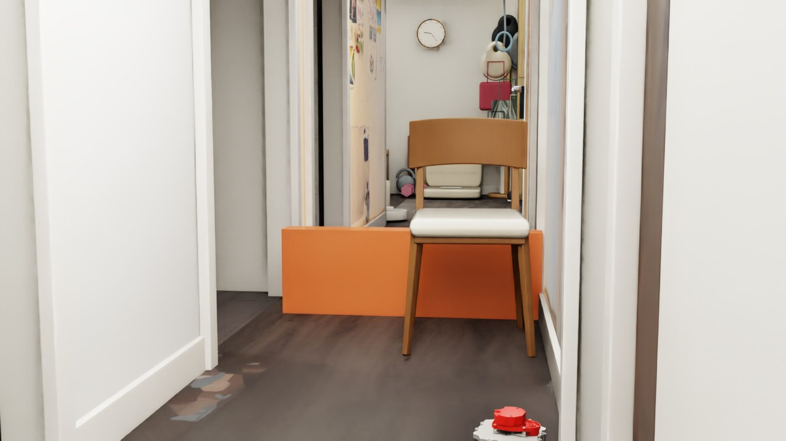
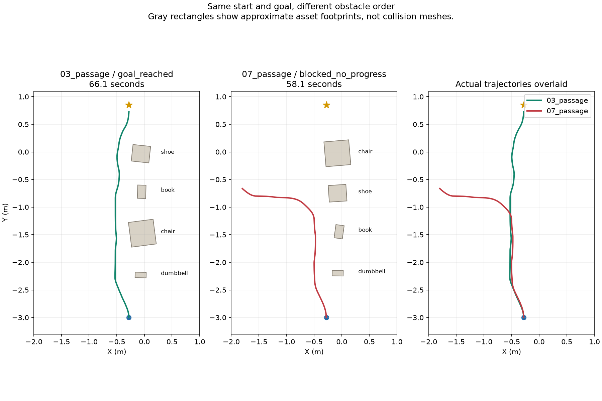
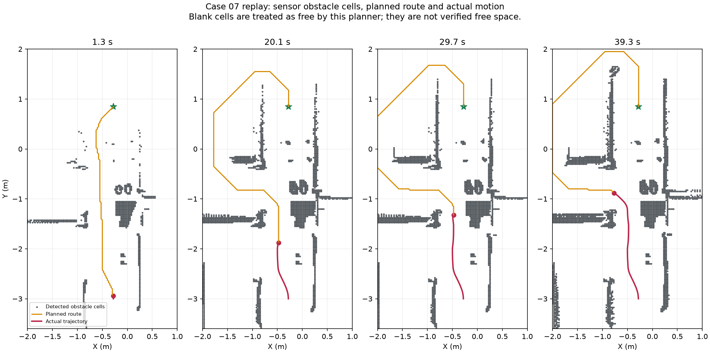
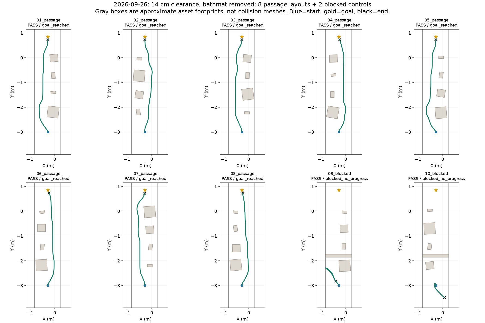

DEVLOG · 2026.09.26 · REPEATABLE NAVIGATION

# 换一种摆法， 还能通过吗？

从最初的 3/8 失败轨迹出发，作为实验观察者，我判断地垫和安全距离可能改变选路；逐项对照验证后，八组通行全部到达目标。详见下方“实验观察者的路线判断”。

01 / TEST DESIGN

## 改变布局，保持控制参数。

随机种子为 2026092601–2026092610。前八组在走廊左右两侧交替放置书、鞋、哑铃与椅子，随机改变顺序、位置和 ±10° 内的朝向，预留另一侧通道；后两组增加横跨走廊的静态挡板，检查无法通过时能否停车。

这是一组受约束的左右通道测试，不是任意位置、任意朝向的全面随机测试。准备阶段修正了摆放边界以避免旋转物品嵌入墙壁，早期中止的准备运行不计入正式十组。正式测试未中途调参或删除失败结果。

沿用昨日深度 + 水平 LiDAR、地面拟合、2.5 cm 占据网格与 A\*，机器人膨胀半径 17.5 cm，线速度上限 0.065 m/s，角速度上限 0.55 rad/s。定位仍用仿真真实位姿，深度为理想渲染数据，障碍保持静态。

第一组：物品放在右侧，左侧留出通道。

02 / RESULTS

## 把到达与停车分开统计。

**预留通道：3/8 到达并符合接触与制动要求。堵路对照：2/2 符合预设停车标准。**这两组也出现向起点后方选路，最后由无进展保护停止；这里只满足预设停车判据，不能证明正确识别了堵路。堵路停车不能算作到达目标，不能合并成“十组都成功导航”。

| 组别 | 类型 | 验收 | 停止原因 | 仿真时长 | 最大接触力分量 |
| --- | --- | --- | --- | --- | --- |
| 01\_passage | 预留通道 | 通过 | 到达目标 | 67.1 s | 0.000 N |
| 02\_passage | 预留通道 | 未通过 | 无进展停车 | 18.3 s | 0.000 N |
| 03\_passage | 预留通道 | 通过 | 到达目标 | 66.1 s | 0.000 N |
| 04\_passage | 预留通道 | 未通过 | 无进展停车 | 18.3 s | 0.000 N |
| 05\_passage | 预留通道 | 通过 | 到达目标 | 67.9 s | 0.000 N |
| 06\_passage | 预留通道 | 未通过 | 无进展停车 | 18.3 s | 0.000 N |
| 07\_passage | 预留通道 | 未通过 | 无进展停车 | 58.1 s | 0.000 N |
| 08\_passage | 预留通道 | 未通过 | 无进展停车 | 18.3 s | 0.000 N |
| 09\_blocked | 堵路对照 | 通过 | 无进展停车 | 19.3 s | 0.000 N |
| 10\_blocked | 堵路对照 | 通过 | 无进展停车 | 18.3 s | 0.000 N |

到达阈值为距目标小于 12 cm；接触力采样分量不超过 0.1 N，停车后位移小于 3 cm。堵路组还要求因无路径或无进展停车，且停在挡板之前。每组最多 100 秒，18 秒没有足够目标距离改善则停车。零接触采样不等于连续时间的形式化证明。

03 / RECORDING

## 十组完整录像，包括失败。

十组实测轨迹：蓝点为起点，星号为目标，黑叉为终点。灰框仅示意资产占地。

[▶ 观看十组完整录像](https://mondaywmd.github.io/monday-robotics-universe/assets/omniverse/random-navigation/suite.mp4)

逐组标注 PASS / FAIL 和停止原因。约 5 Hz 视口采集，按仿真时间编码为 25 fps，每组末尾保留约 1 秒。

[打开完整录像 ↗](https://mondaywmd.github.io/monday-robotics-universe/assets/omniverse/random-navigation/suite.mp4)

第一组结束位置：到达目标。

第二组失败：机器人转向起点后方，最终因目标距离无改善而停车。

04 / WHAT WE LEARNED

## 通过一组，不等于稳定可靠。

第二组的轨迹显示，初始朝目标方向后转身向起点后方行驶，最后触发无进展停车；该次没有检测到物体接触。这提示要检查感知地图与路径选择，不能用“推不动鞋子”解释，也不能仅凭录像认定某个传感器参数是根因。

第七组走到走廊侧面区域后也因无进展停车，最终 X 约 −1.81 m；这说明问题不只表现为起点处掉头。当前地图把未知区域视为可通行，累计障碍点不做动态清除，未独立核验深度帧时间戳。下一步应记录规划路径、占据图与深度平面拟合质量，在同一失败种子上隔离原因，再另开版本重跑；本轮结果保留作为基线。

堵路对照组：以独立挡板明确规定前方无法通行。

05 / REPLAY

## 结果与脚本一起保存。

[十组结果 JSON](https://mondaywmd.github.io/monday-robotics-universe/assets/omniverse/random-navigation/summary.json) · [下载测试脚本](https://mondaywmd.github.io/monday-robotics-universe/assets/omniverse/random-navigation/test-script.zip) · [GitHub 图文与逐组轨迹报告](https://github.com/mondaywmd/navbot-simulation)

先保存场景，在已有本地 NavBot 项目中通过 Script Editor 运行。脚本依赖原场景和资产库，切换测试场景并覆盖同名结果，不能与其他控制脚本同时运行；只按 Play 不会启动整套测试。下载包不含模型。

## 下一步，解释失败。

[上一篇：深度感知与推撞](https://mondaywmd.github.io/monday-robotics-universe/navbot-depth-obstacles.html)

## 实验观察者的路线判断：从异常轨迹到对照验证

最初八组预留通道只有 3 组到达。作为实验观察者，我没有只看通过率，而是逐段比较机器人走过的路线。第二组刚起步就掉头；第七组与成功的第三组同样从走廊左侧绕行，却在椅子附近转进旁边房间。我据此分别检查地垫和通行距离。

### 第二组：地垫判断

我发现右侧地垫位于第二区域的绕行线路旁。凸起地垫模型最高约 2.1 cm，深度感知把高于估计地面 1.2 cm 的点记作障碍。使用同一种子 `2026092602`、相同四件物品布局、目标和控制参数，仅在测试副本中关闭凸起地垫：原先 18.3 s 无进展停车，移除后 65.9 s 到达目标，未检测到碰撞。这是支持地垫触发该组失败的对照证据。地板贴图中的浅色图案未消除。

[▶ 观看第二组移除地垫后的录像](https://mondaywmd.github.io/monday-robotics-universe/assets/omniverse/random-navigation/observer-followup/case02-no-bathmat.mp4) · [对照数据](../results/random-navigation-20260926-followup/case02-comparison.json)

### 第七组：安全距离判断

第七组保留地垫，原样重跑，仍在 58.1 s 无进展停车，最终进入左侧房间。保存的感知障碍点和规划路线表明，规划器主动选择向左走，并非驱动器跑偏。机器人模型的水平包围半径约 10.5 cm；原脚本要求中心距障碍至少 17.5 cm，约等于车身外再留 7 cm。第七组约 29.7 s 的地图上，仅限走廊的可行路线最大中心净空约 15.2 cm，因此被原阈值排除。

仅把最小中心距离改为 14 cm，保留地垫、物品布局及其他参数后，第七组留在走廊，66.9 s 到达目标，未检测到碰撞。14 cm 约等于水平车身包围圆外留 3.5 cm，是这个仿真场景验证过的工作值。

[▶ 观看第七组 14 cm 的对照录像](https://mondaywmd.github.io/monday-robotics-universe/assets/omniverse/random-navigation/observer-followup/case07-clearance14cm.mp4) · [对照数据](../results/random-navigation-20260926-followup/case07-comparison.json)

### 保存后的十组回归

我最后在后续场景中关闭凸起地垫，并保存 14 cm 的通行距离；用原十个种子完整回归。八组预留通道 **8/8 到达**（原为 3/8）；两组封路对照 **2/2 安全停止**。封路停车依赖“持续没有进展”保护，不能据此宣称机器人理解了死路。

[新版十组报告](../results/random-navigation-20260926-followup/summary.json) · [新版可执行脚本](../scripts/navbot_random_suite_14cm.py) · [网站图文日志](https://mondaywmd.github.io/monday-robotics-universe/navbot-random-navigation.html#observer-followup)

侧房实际上无法通往客厅目标。当前地图把未知区域视为可走，尚未加入房间之间正确的连接关系。上述回归验证了这十组布局的改善，下一步仍需补上静态布局地图。

